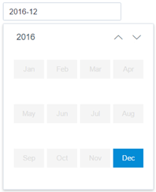

##  Gemini DatePicker
> A full-featured datepicker jquery plugin.

### Features
+ Supports more configurable options.
+ Supports more methods
+ Supports more events
+ Supports datetime mode
+ Supports range date and range datetime mode
+ Supports internationalization
+ Cross-browser support

### Example image
##### Type: date

##### Type: month

##### Type: year

##### Type: datetime

##### Type: date-range

##### Type: datetime-range


### Getting started
#### Quick start
+ Clone the repository: git clone https://github.com/gregzhang616/jquery-datepicker.git.
+ Install with Npm: npm install gemini-datepicker.
+ Install with Bower: bower install gemini-datepicker.

#### Installation
##### Include files:
Css file
```
<link rel="stylesheet" href="/assets/css/iconfont.css">
<link rel="stylesheet" href="/css/jquery.datepicker.min.css">
```
Javascript file
```
<script src="/assets/js/jquery.min.js"></script>
<script src="/js/jquery.datepicker.min.js"></script>
// there is no need to import the next line of code when current language is 'en-US'
<script src="/i18n/datepicker.zh-CN.js"></script>
```

##### CommonJs / NodeJs:
Css file
```
require('gemini-datepicker/dist/css/jquery.datepicker.min.css');
```

Javascript file
```
require('gemini-datepicker');
```


### Attributes
>You may set datepicker options with $().datepicker(options), the options type is Object.

| Name | Type  | Default value | Optional value | Description |
| :--- | :--- | :--- | :--- | :--- |
| type | String | 'date' | year/month/date/datetime/datetime-range/date-range | type of the picker |
| readonly | Boolean | false | false/ true | whether DatePicker is read only |
| disabled | Boolean | false | false/ true | whether DatePicker is disabled |
| format | String | 'yyyy-MM-dd' | year->yyyy, month->MM, day->dd, hour->HH, minute->mm, second->ss | format of the picker |
| placeholder | String | 'Please pick a day' | -- | init input element's placeholder |
| align | String | 'left' | 'left'/'center'/'right' | the pick panel's alignment |
| weekStart | Number | 0 | -- | Start of the week |
| startDate | Date | null | -- | If the start date exists, the date before the start date is disabled  |
| endDate | Date | null | -- | If the end date exists, the date after the end date is disabled |
| lang | String | 'en-US' | 'en-US'/'zh-CN'/'vi' | language of the datepicker |
| rangeSeparator | String | '-' | -- | if type is 'date-range' or 'datetime-range', use rangeSeparator to separate the date |
| defaultValue | String/Date | '' | -- | default date, if picker type is date-range or datetime-range, picker's type must be String |
| zIndex | Number | 2008 | -- | The CSS style z-index for the picker. |

### Methods
> Common usage

```
$().datepicker(methodName, argument1, argument2, ..., argumentN);
```
##### setDate(date)
Set the current date with a new date, parameter date type is String or Date .
```
$().datepicker('setDate', '2016-02-09');
$().datepicker('setDate', new Date(2016, 1, 9));
```

##### getDate()
Get the current date.
```
$().datepicker('getDate');
```

##### clear()
Clear the picker date (when date is cleared, the current date is displayed by default).
```
$().datepicker('clear');
```

##### show()
Show the picker panel.
```
$().datepicker('show');
```

##### hide()
hide the picker panel.
```
$().datepicker('hide');
```

##### disable(value)
disable or enable the picker, if parameter value is true that can disable the picker, otherwise can enable the picker.
```
// disable the picker
$().datepicker('disable', true);
// enable the picker
$().datepicker('disable', false);
```

##### destroy()
Destroy the picker and remove the instance from target element.
```
$().datepicker('destroy');
```

### Events
> Common usage

```
$().on(eventName, function (e, arguments) {
  // todo
});
```

##### pick.datepicker
This event fires when date is changed.
* event ( Type: Object )
  * newDate ( Type: String )
  * oldDate ( Type: String )

```
$().on('pick.datepicker', function (event) {
  console.log('newDate: ' + event.newDate);
  console.log('oldDate: ' + event.oldDate);
});
```

##### show.datepicker
This event fires when picker is show.

```
$().on('show.datepicker', function (e) {
  // todo
});
```

##### hide.datepicker
This event fires when picker is hide.

```
$().on('hide.datepicker', function (e) {
  // todo
});
```
### Callbacks
> Common usage

```
$().datepicker({
    CallbackName: function () {
      // todo
    }
});
```
##### onChange
A shortcut of the "pick.datepicker" event, this callback called when picker value is changed.

```
$().datepicker({
    onChange: function (events) {
      console.log('newDate: ' + event.newDate);
      console.log('oldDate: ' + event.oldDate);
    }
});
```

##### onShow
A shortcut of the "show.datepicker" event, this callback called when picker is show.

```
$().datepicker({
    onShow: function () {
      // todo
    }
});
```
##### onHide
A shortcut of the "hide.datepicker" event, this callback called when picker is hide.

```
$().datepicker({
    onHide: function () {
      // todo
    }
});
```


### Locale
> I18n config, default language is en-US

##### Usage
```
<script src="/js/jquery.datepicker.min.js"></script>
<script src="/i18n/datepicker.zh-CN.js"></script>
<script>
  $().datepicker({
    lang: 'zh-CN'
  });
</script>  
```

### Run example
> Please download the project, and then enter into this directory.(download gulp-sass plugin need to connect vpn)

+ npm install
+ gulp
+ Access "http://localhost:8081/examples/index.html" in browser


### Browser support
* Chrome Most versions
* Firefox Most versions
* Safari Most versions
* Opera Most versions
* Edge Most versions
* Internet Explorer 8+

### Author
Greg Zhang from Baidu (gregzhang616@gmail.com).

### Remarks
Thanks for the eleme UED team to provide such a good UI design.
